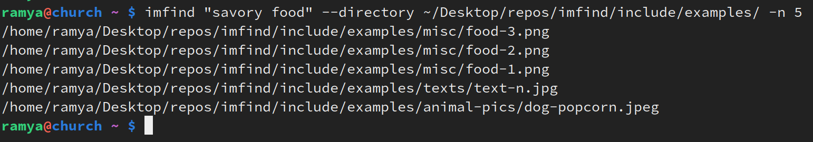
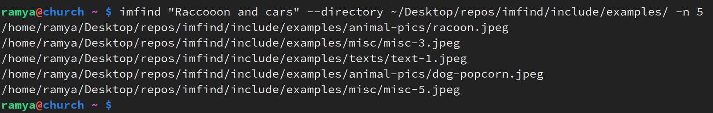
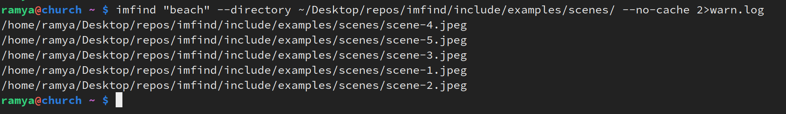
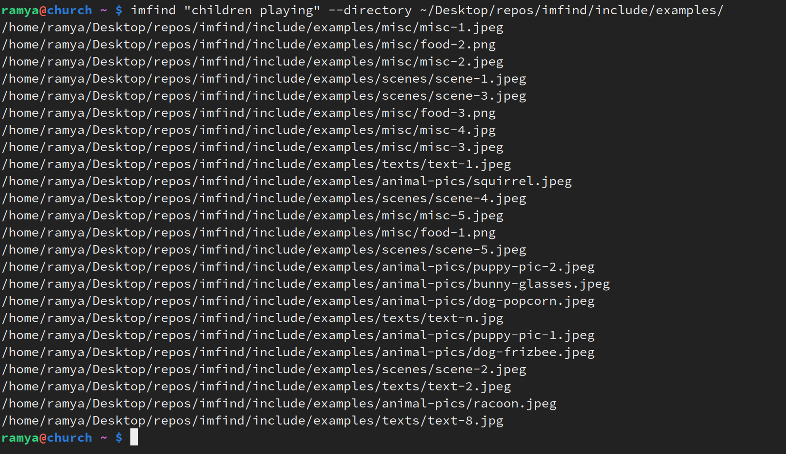
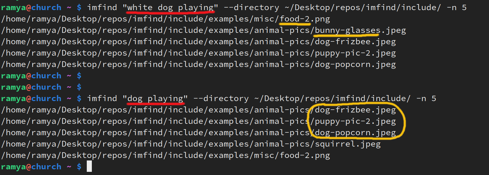

## ImFind 🖼️ 

Remember what an image, pic or screenshot looks like but can't for the life of you remember where you put it? 

Or what you named it? 

Or there's just too many damn screenshots to go through all of them? 

 

Been there. Too many times.

So here's a simple tool to help with that.

---
### Setup

Install python3 if not already installed. Run `which python3` to check.
**Recommended python>=3.11**

For GPU usage, if available, make sure CUDA is installed and setup. Follow installation guides [here](https://docs.nvidia.com/cuda/#installation-guides). 
**Recommended >16GB GPU memory** 

To install:
```
pip3 install imfind
``` 

Can also clone this repo and run 'make develop' to install in editable mode.

---
### Usage 

```
imfind <search string> -d <directory> -n <top n>
```  

```
imfind "beach" --directory ./include/examples/ -n 5
```

`imfind <search string>` -- Searches in $HOME by default if `-d` or `--directory` not provided. This can take a while if there are lots of images (generation + ocr + caching). Can do first run in the background/overnight.

❗**Try re-running command if CUDA Out Of Memory error with the `embed` module.**

This occurs if there is not enough memory to load the embedding model in the end after generating all the descriptions. Re-running will use the cache next time and not load the bigger model so there should be enough space for the embedding model.

Do `imfind --help` to see full usage. 

Run `make check` in repo root to run tests. See in 'tests' for example library usage.

---
### Examples

 
 


 
 
 


 
 


 
 


---

### How it works

Using current SOTA models like [FlagEmbedding](https://github.com/FlagOpen/FlagEmbedding) for embedding text, [LLaVa v1.5](https://huggingface.co/llava-hf/llava-1.5-7b-hf) and [Blip Image Captioning](https://huggingface.co/Salesforce/blip-image-captioning-large) for image-to-text models for generating detailed image descriptions and [EasyOCR](https://github.com/JaidedAI/EasyOCR) for extracting any text in the images. 

All are open-source and local models, making it widely accessible and your data doesn't leave your device!

The tools main goal is workflow optimization. Instead of spending say 10 min each time trying to search for some image manually, get a good approximation of where/what it could be in the top 10-15 results in a few seconds!

**Given a description of an image you want to find, this library:**


1. Embeds the given user description using an embedding model. 


2. Finds all images in the given directory and (if not already previously done (via caching)) generates a description of the each of the images and embeds them. Uses an image-to-text like model with a default prompt to generate a decription of the image, appending any text extracted via OCR and optionally adding a user custom prompt if provided. 


3. Finds the most similar images based on similarity between the user description and the generated image description embeddings (nothing fancy, just your simple dot products). 

If no gpu is available, by default uses the BLIP image captioning model which is much smaller in size and has fast inference times even on cpu.
**If gpu is available and LLaVa-v1.5 model can be loaded and run, only then uses the LLava model. Else, uses BLIP on gpu. LLaVa on cpu is too slow.**
EasyOCR is tried in both cases.

Try `ls ~/.cache/mmry/image_and_text_to_text/blobs | wc -l` to see how many images are cached for the big llava model. See in cache `image_to_text` for blip model.

#### Possible errors while running LLaVa 1.5 on GPU
- If Pytorch reserved but unallocated memory is a lot, then try `export PYTORCH_CUDA_ALLOC_CONF=expandable_segments:True` 
- Check there is enough memory on GPU (`nvidia-smi`) to be able to load the model onto it. Uses `device_map='auto'` only if multiple gpu's are available. If not multi-gpu, tries to load the entire model onto single gpu. 
- If Cuda Out of Memory error with **embed** module, for example: 
```
FileNotFoundError: [Errno 2] No such file or directory: '/home/ubuntu/.cache/mmry/embed/flag/large/normalized/blobs/...
```
Then, just try **re-running the command** to reuse existing cache and generate cache only for previously missed images. 

---
### Notes

- If on cpu and using the BLIP model, the image-to-text generations are small and not too detailed (~15-20 words). So keep your description of what you want to search for limited to a few key words so that the embedding search can work better. Then the dot product won't be skewed by other less important words. 
    - For example, using the prompt "white dog playing" matches a food pic and a bunny pic first due to the "white" key word. 

     

- The first time you run the command on a new directory it will take some time to download the models, generate the descriptions of all the images and embed and cache them. It's a good idea to leave this running in the background/overnight. Any subsequent runs should be quick thanks to the awesome cacheing implementation in [embd](https://github.com/notarealdeveloper/embd) using [mmry](https://github.com/notarealdeveloper/mmry). 

- If you want to clear the cache of all the text and image embeddings (for re-runs, new models, debugging etc.,) simply do `rm -rf ~/.cache/mmry`.

- Pass in the `--no-cache` option to not use existing cache and regenerate descriptions. If using as a importable library do `export $USE_MMRY_CACHE="False"` to disable cache and regenerate.
 
- If you remember part of what you named the file, or some other unique file name identifier, don't forget your simple (but awesome) unix tools like `locate`. 

```
locate comic
> include/imfind-comic.png
```

---
---
### Model Inference Times

These are the approximate model loading and generation times given the below specs (not using caching functionality). 

**CPU/GPU Specs:**
```
>lscpu

Architecture:                         x86_64
CPU op-mode(s):                       32-bit, 64-bit
Address sizes:                        46 bits physical, 48 bits virtual
Byte Order:                           Little Endian
CPU(s):                               8
On-line CPU(s) list:                  0-7
Vendor ID:                            GenuineIntel
Model name:                           Intel(R) Xeon(R) Platinum 8259CL CPU @ 2.50GHz
CPU family:                           6
Model:                                85
Thread(s) per core:                   2
Core(s) per socket:                   4
Socket(s):                            1
Stepping:                             7
BogoMIPS:                             4999.99


>nvidia-smi

+-----------------------------------------------------------------------------------------+
| NVIDIA-SMI 560.35.03              Driver Version: 560.35.03      CUDA Version: 12.6     |
|-----------------------------------------+------------------------+----------------------+
| GPU  Name                 Persistence-M | Bus-Id          Disp.A | Volatile Uncorr. ECC |
| Fan  Temp   Perf          Pwr:Usage/Cap |           Memory-Usage | GPU-Util  Compute M. |
|                                         |                        |               MIG M. |
|=========================================+========================+======================|
|   0  Tesla T4                       Off |   00000000:00:1E.0 Off |                    0 |
| N/A   26C    P8              9W /   70W |       5MiB /  15360MiB |      0%      Default |
|                                         |                        |                  N/A |
+-----------------------------------------+------------------------+----------------------+
                                                                                         
+-----------------------------------------------------------------------------------------+
| Processes:                                                                              |
|  GPU   GI   CI        PID   Type   Process name                              GPU Memory |
|        ID   ID                                                               Usage      |
|=========================================================================================|
|    0   N/A  N/A       972      G   /usr/lib/xorg/Xorg                              4MiB |
+-----------------------------------------------------------------------------------------+

``` 

#### EasyOCR
- Automatically detects and uses gpu.
- On 4 core cpu `Intel(R) Core(TM) i7-5500U CPU @ 2.40GHz`:
    - ~6 sec to load model/reader
    - ~15 sec for extracting ~413 characters
    - ~400 ms if no text found

- On above specs, automatically uses GPU:
    - micro seconds to load model/reader
    - ~700 ms - 1 sec for extracting ~413 characters
    - ~25 ms if no text found

| Model        | Model Size  | Initial Model Load and Inference | Inference After Loading |
|--------------|-------------|----------------------------------|-------------------------|
| **Blip**     | ~2GB        |                                  |                         |
| GPU (1024 tokens) | | ~5 - 20 sec                     | ~350 - 630 ms            |
| CPU (1024 tokens) | | ~5 sec                          | ~2.2 - 2.6 sec           |
| **LLaVA v1.5** | ~14GB       |                                  |                         |
| GPU (1024 tokens) | | ~30 - 60 sec                    | ~7 - 15 sec              |
| GPU (512 tokens)  | | ~16 sec                       | ~7 - 15 sec              | 


- Not testing big models on cpu, will not be using them on cpu either.
- Trade-off between better generation quality but much longer times (on cpu) is not worth it for this tool. In that time, the user might as well manually search for the image.
- Speed and ease of use are very important here. It should help fasten users workflow. An OK result of the top n most similar images produced *quickly* is much more valuable and usable here than a great result (description wise) that takes a very long time. Even a basic description will likely put the desired image in top 10, 20 etc., 
